# Questão de Ritmo

Planejador de estudos para concursos com painel de desempenho, edital, ciclos por progresso, revisões, simulados e materiais organizados por assunto.

## Plano integrado para vários editais

Em **Plano integrado**, selecione pelo menos dois concursos em preparação, informe suas horas semanais e o tempo por assunto novo. **Gerar plano de hoje** reúne assuntos equivalentes em uma única linha, mostra quais editais cada estudo atende e respeita a carga diária dividida pelos dias de estudo de Ajustes. Revisões vencidas têm prioridade; peso, desempenho compartilhado, prazo da prova e pendências anteriores orientam a seleção. Assuntos exclusivos também participam da carga.

**Concluir** registra a atividade, o tempo estimado e as questões uma única vez. A etapa é aproveitada nos assuntos equivalentes selecionados e as revisões permanecem agendadas; não são criadas questões ou atividades por edital. **Atualizar plano de hoje** recalcula as pendências sem apagar conclusões. Concursos realizados ou com prova passada não entram em novos planos. As horas e o tempo são estimativas; a seleção não garante cobertura completa até a prova. O plano integrado é uma alternativa aos planos individuais: escolha um deles para executar sua rotina.

## Conciliar editais e aproveitar a prática

Abra **Conciliar editais** e escolha dois concursos. A tela mostra assuntos em comum, porcentagem de cobertura de cada edital, sobreposição global (interseção ÷ união) e assuntos exclusivos. Os denominadores contam assuntos distintos, evitando inflar a comparação com entradas repetidas. A tela também mostra cobertura ponderada, pesos configuráveis por assunto e uma estimativa de carga até a primeira prova. Informe as horas semanais disponíveis para os dois editais e ajuste os pesos em **Ajustar importância das matérias**. A estimativa deduplica assuntos comuns e usa minutos por matéria ÷ assuntos por dia; revisões, prática e imprevistos precisam de reserva adicional.

Matéria e assunto iguais são reconhecidos ignorando acentos, pontuação e numeração. Português e Língua Portuguesa são tratados como a mesma matéria. Para nomes diferentes, selecione os assuntos e use **Confirmar assuntos equivalentes**. O vínculo manual pode ser removido. Uma semelhança de palavras, sozinha, não cria equivalência automática.

Questões registradas na plataforma aparecem somadas nos assuntos equivalentes dos seus outros editais, com origem e acertos. Os registros locais e a atividade global não são copiados nem duplicados. Em Hoje, Edital e na comparação, **Pular assunto já praticado** aproveita a etapa inicial, mantém revisões e não conta nova atividade nem domínio. **Voltar a estudar** desfaz o aproveitamento enquanto ele ainda não foi substituído por estudo real. Resultados de Qconcursos ou TEC continuam dependendo do registro manual na plataforma.

Excluir um concurso, matéria ou assunto agora preserva os registros existentes de prática (quantidade, acertos, erros derivados, data e histórico). Eles aparecem em **Concursos → Histórico preservado**, continuam no backup e podem ser aproveitados por novos editais equivalentes. Exclusões anteriores a esta versão só podem ser recuperadas se houver um backup. Uma restauração da mesma origem não duplica os registros.

Os detalhes da prática distinguem amostras menores que 20 questões, desempenho abaixo de 80% e prática com mais de 30 dias. São indicadores de atenção, sem comprovar domínio; dados antigos sem data ficam identificados. **Hoje → Prioridades do plano de hoje** explica as sugestões por desempenho compartilhado, peso e atraso. A seleção de revisões usa esses critérios sem alterar seu ciclo ou cronograma. Detalhes de prática e ações ficam recolhidos na comparação para manter as tabelas compactas.

## Cadernos de questões externos

Em **Edital** ou **Hoje**, use **Buscar questões** ao lado de um assunto. O nome já aparece preenchido e pode ser ajustado antes da busca. **Buscar no Qconcursos** abre questões por palavra-chave; confira os filtros de disciplina e assunto. Para o **TEC Concursos**, copie o assunto, abra a plataforma e escolha seus filtros. A criação e o salvamento do caderno são feitos na sua conta da plataforma externa. Depois cole a URL nos campos de cadernos e salve: o link ficará disponível diretamente naquele assunto, inclusive após recarregar a página. O aplicativo não recebe credenciais dessas plataformas e não sincroniza automaticamente as questões resolvidas nelas.

## Interface

Identidade em azul profundo e turquesa, símbolo Q com check, ícones duotone, navegação lateral recolhível e temas claro e escuro. O tema claro é o padrão para novas visitas; sua escolha anterior é preservada e pode ser alterada em **Ajustes**. A interface se adapta ao celular e oferece indicação visível de foco para navegação por teclado. As matérias mantêm seus títulos, com assuntos organizados em tabela: situação, questões, cadernos e ações. Na tela de hoje, os controles também ficam alinhados por assunto. As colunas permanecem lado a lado e se ajustam à largura disponível, sem rolagem horizontal.

As capturas abaixo mostram a aplicação real com dados fictícios de demonstração. Nenhuma conta, questão de prova ou informação de usuário real foi usada nas imagens.

### Painel, concursos e revisões

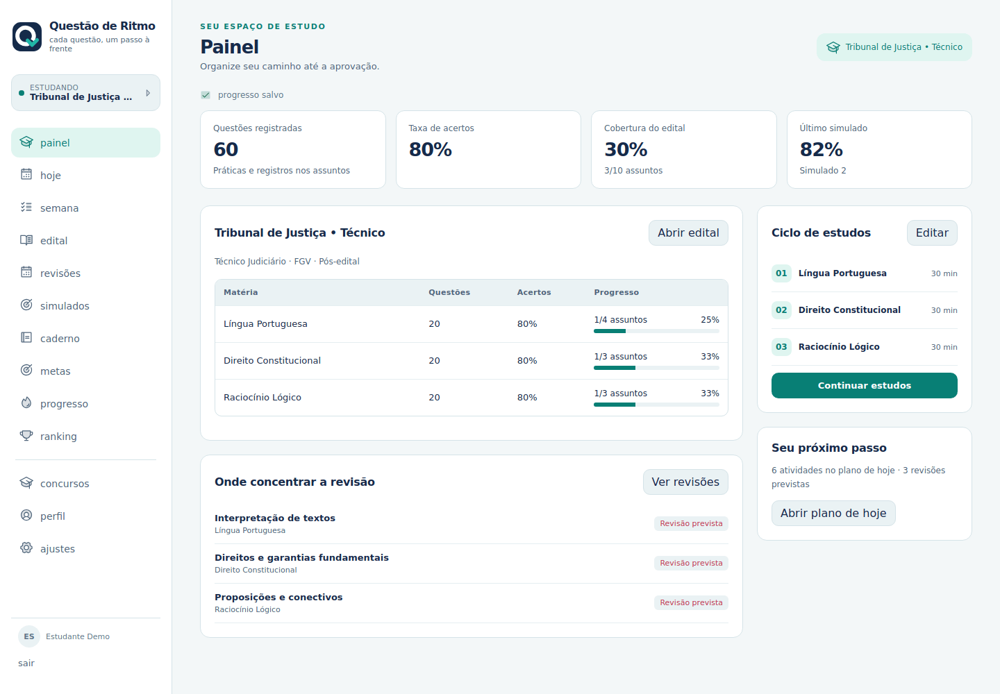

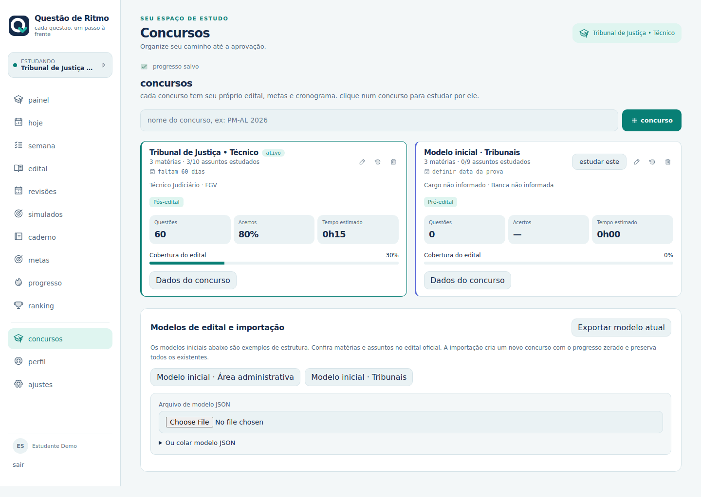

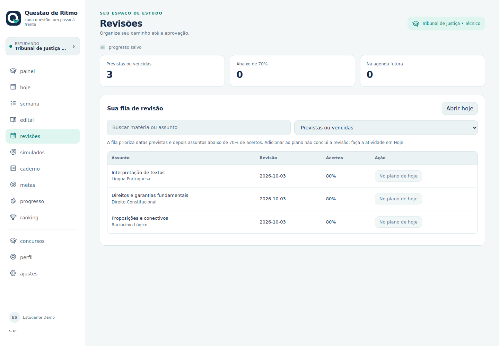

### Simulados, materiais e modelos

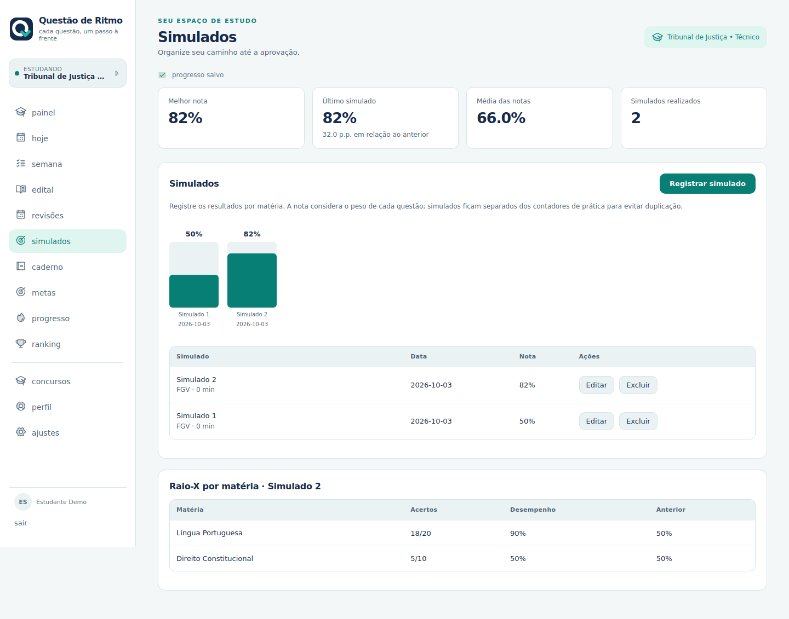

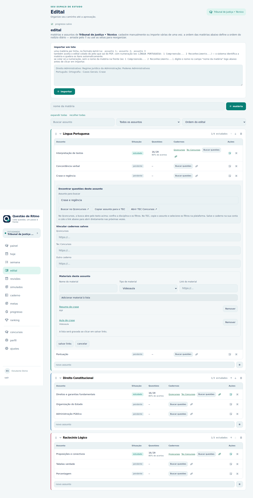

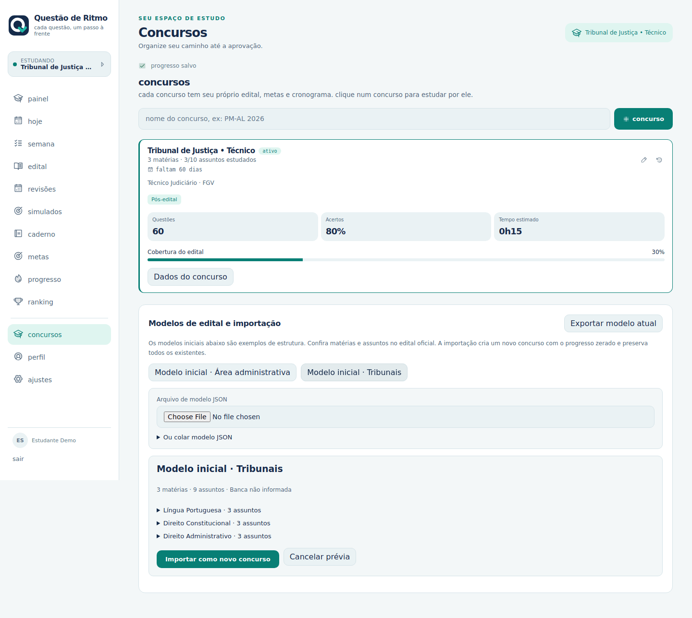

### Menu lateral minimizado

Use o botão de seta no topo do menu para recolher ou expandir. A preferência fica salva no navegador; no celular o menu continua abrindo pelo botão superior.

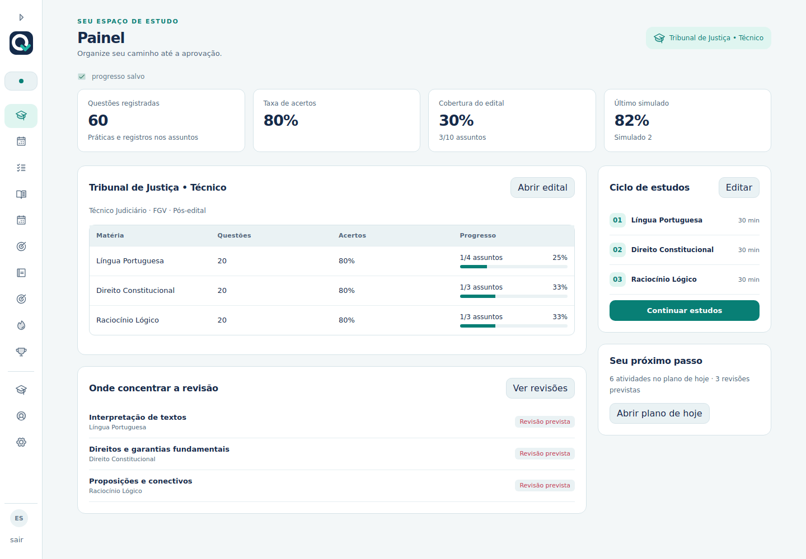

### Seu plano de hoje

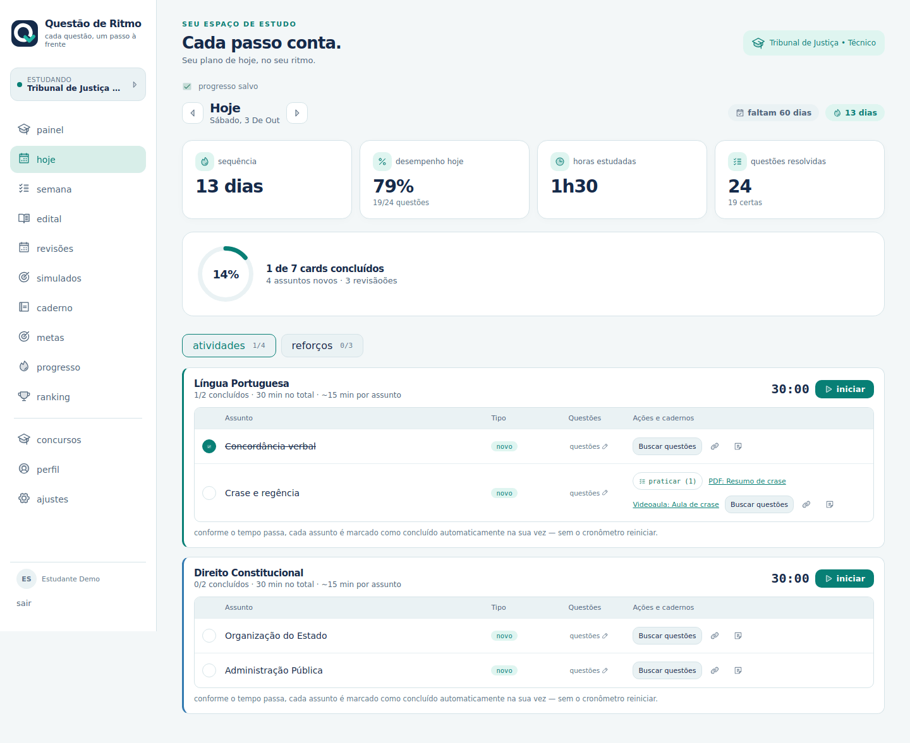

### Entrada

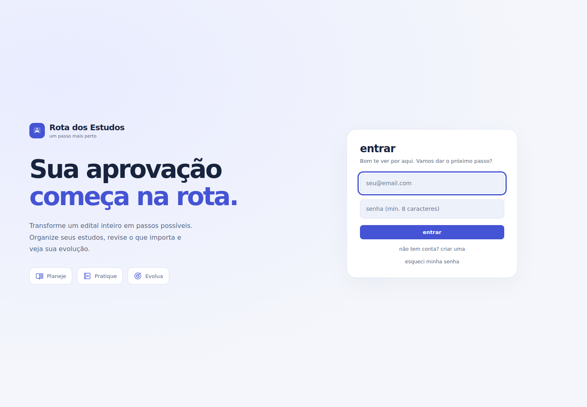

### Edital e caderno de erros

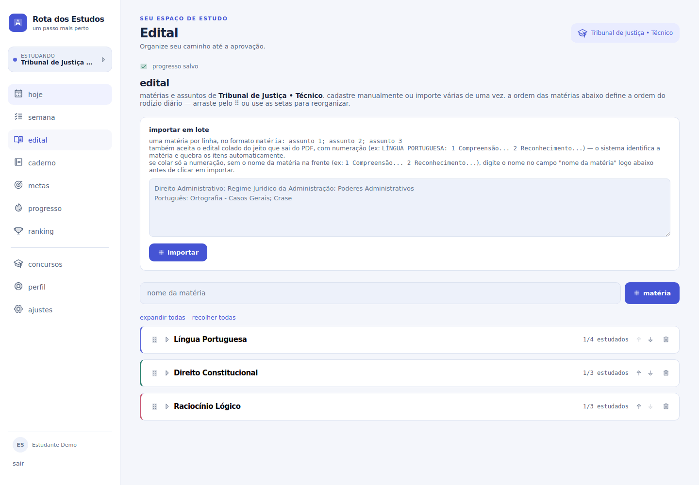

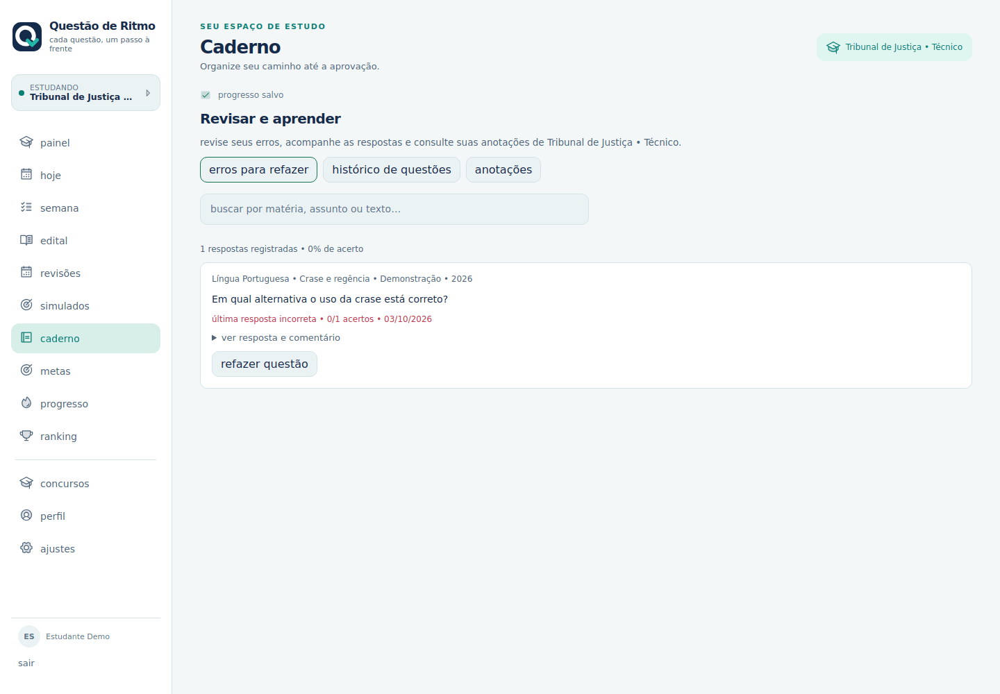

### Tema escuro e celular

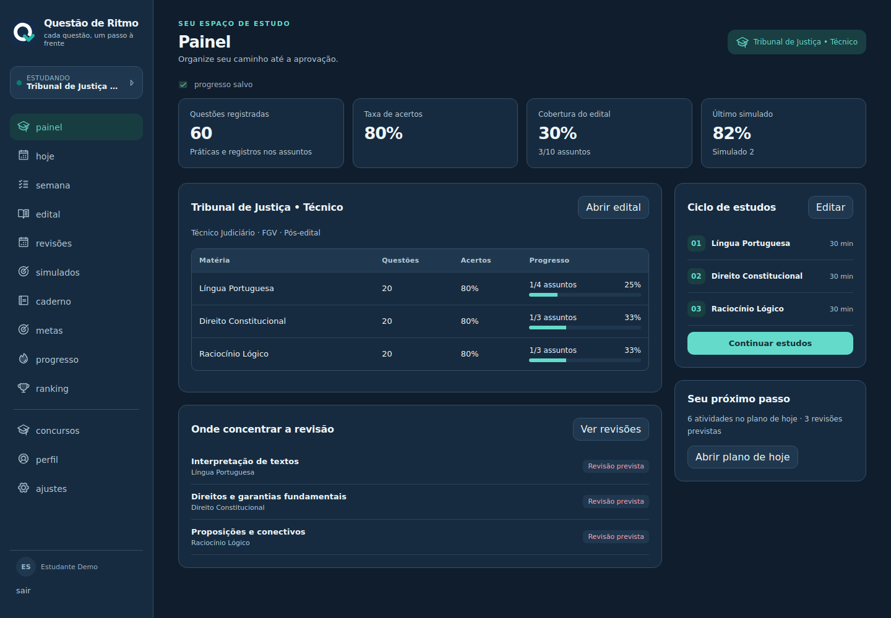

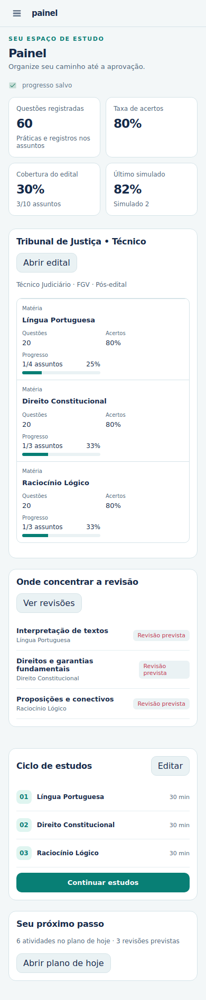

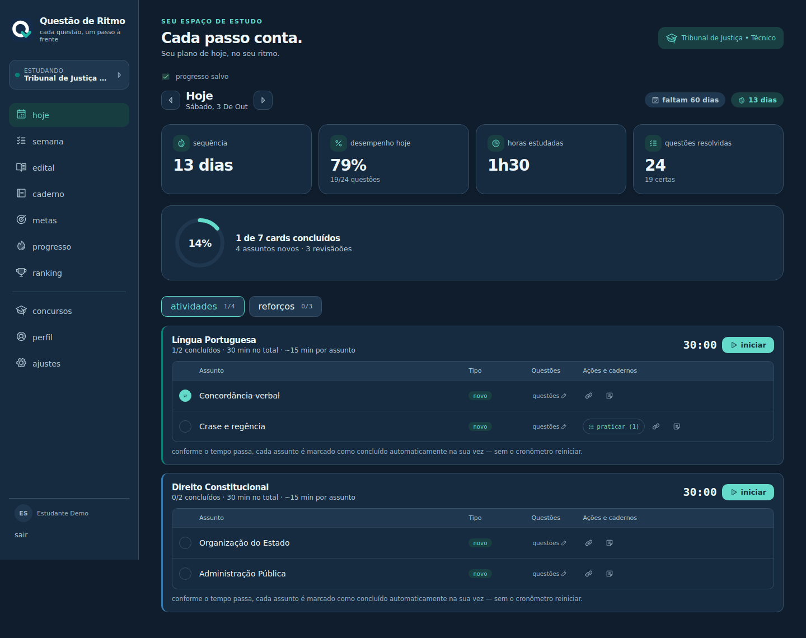

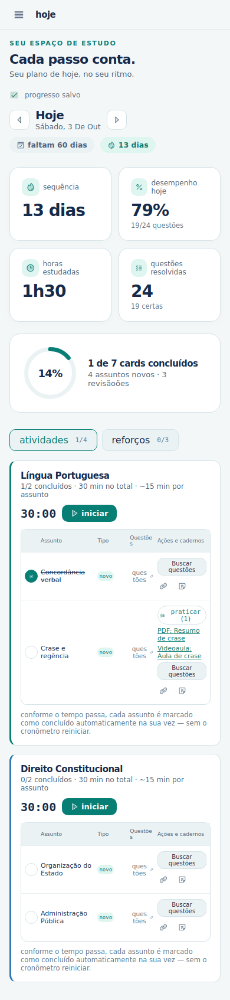

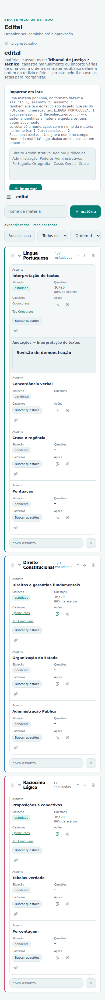

## Funcionalidades

- **Painel:** visão por matéria, cobertura do edital, questões praticadas, último simulado e ciclo ou cronograma ao lado.
- **Simulados:** registro manual por matéria, pesos, evolução das notas e comparação de desempenho; resultados separados das questões praticadas. A nota é a porcentagem ponderada de acertos, sem penalidade por erro.
- **Materiais:** PDFs, vídeos, cadernos e outros links por assunto, salvos junto aos links externos.
- **Modelos:** prévia, importação e exportação de estrutura do edital, sempre criando um novo concurso e preservando os existentes.
- **Hoje:** assuntos novos e reforços, conclusão de cards, cronômetros e registro de questões.
- **Semana:** previsão de matérias para 35 dias. A previsão é estimada: o ciclo avança conforme a conclusão real dos estudos.
- **Edital:** cadastro manual, importação de texto numerado ou no formato `Matéria: assunto; assunto`, catálogo compartilhado de matérias, anotações e links por assunto.
- **Metas:** matérias e assuntos por dia, duração de sessões, descanso e quantidade de revisões.
- **Planejamento:** ciclo por progresso ou cronograma fixo por dia da semana. Pendências continuam no ciclo até serem concluídas.
- **Revisões:** fila com filtros por vencimento, baixo desempenho e assunto; botão para incluir no plano de hoje. Intervalos de 1, 3, 7, 15 e 30 dias, com limite diário configurável. As revisões vêm de todas as matérias, independentemente das matérias novas do dia.
- **Caderno:** erros para refazer, histórico por questão e anotações. Um erro deixa a lista de pendências quando a última resposta passa a ser correta; as tentativas anteriores continuam no histórico.
- **Questões:** banco extraído de provas, seleção por matéria/assunto/banca, correção no servidor e registro individual de respostas. Cada tentativa tem identificador próprio para impedir duplicação em uma repetição da requisição.
- **Links:** Qconcursos, Tec Concursos e outro caderno podem coexistir em cada assunto. Links antigos continuam disponíveis.
- **Progresso:** atividade, sequência, minutos e desempenho. Dias de descanso configurados não interrompem a sequência.
- **Concursos:** cartões com banca, cargo, fase, edital, data da prova, cobertura e indicadores. Tempo de estudo estimado a partir das sessões concluídas e metas, identificado como estimativa. Reinício de ciclo com opção de preservar o histórico.
- **Conta:** perfil, ranking opcional, senha, código de recuperação e uma sessão ativa por conta.
- **Administração:** usuários, catálogo, recursos, auditoria e backups.
- **PWA:** instalação, notificações opcionais e aviso de atualização. Os recursos de estudo dependem da API; instalar o PWA não fornece funcionamento completo offline.

## Modelos de edital

Em **Concursos**, escolha um modelo inicial, importe um JSON ou cole a estrutura. Confira a prévia e clique em **Importar como novo concurso**. Os exemplos de Área administrativa e Tribunais são pontos de partida; confira e adapte ao edital oficial. O exportador gera o mesmo formato, sem progresso ou simulados:

```json
{
  "name": "Meu concurso",
  "banca": "FGV",
  "cargo": "Técnico",
  "materias": [
    { "name": "Português", "topics": [{ "name": "Crase" }] }
  ]
}
```

O importador aceita até 2 MiB, 200 matérias e 1.000 assuntos por matéria. Novos identificadores são gerados e o progresso começa zerado. Para recuperar o histórico de um plano, use o backup em **Ajustes**.

## Executar localmente

Use **Node.js 22.13 ou superior**. `.nvmrc` indica a versão principal usada no CI.

```bash
npm ci
cp .env.example .env
# Configure o ambiente local seguindo .env.example.
npm run dev
```

O Vite normalmente abre em `http://localhost:5173`. A API usa a porta 4000 e o proxy de desenvolvimento encaminha `/api` para ela. Notificações são opcionais.

```bash
npm run dev:client  # Vite
npm run dev:server  # API com reinício em alterações de código
npm test           # testes unitários e de integração com banco isolado
npm run build      # frontend e service worker em dist/
npm run check      # testes e build
npm start          # API e frontend compilado, na mesma origem
npm run preview    # prévia estática do build; não inicia a API
```

## Proteção do progresso

A aplicação só permite salvar depois de carregar o plano com sucesso. Uma falha de leitura mostra uma mensagem e a opção de tentar novamente, sem substituir dados por um plano novo.

O salvamento usa uma fila com uma requisição por vez e agrupa alterações próximas. A tela informa quando está aguardando, salvando, salvo ou com erro. Falhas transitórias têm até três novas tentativas automáticas; também é possível tentar manualmente ou ao reconectar.

Cada gravação exige a versão lida pelo navegador. Se outra aba salvar primeiro, a API retorna `409 PLAN_CONFLICT` e preserva o plano do servidor. A aba em conflito mantém as alterações locais e oferece um download antes de recarregar. Repetir uma gravação já confirmada no servidor, cuja resposta foi perdida, não cria uma nova versão desnecessária.

Alterações pendentes também ficam no armazenamento local do navegador, separadas por conta. Ao reabrir, a aplicação primeiro consulta o servidor e recupera a cópia local; uma versão incompatível é apresentada como conflito e nunca sobrescreve automaticamente o servidor. Se o navegador bloquear ou ficar sem espaço no armazenamento local, as alterações permanecem na memória da aba e o aviso ao sair continua ativo. Em um computador compartilhado, baixe ou conclua o salvamento das pendências e limpe os dados do site antes de entregar o dispositivo.

A API e o importador de backups validam a estrutura do plano, listas, contagens e links. JSON sem a estrutura esperada é rejeitado. Backups antigos de um único concurso continuam aceitos.

## Dados e recuperação

Em **Ajustes**, exporte o plano antes de substituí-lo e guarde o arquivo para recuperar concursos, anotações, prática preservada e atividade. O JSON do plano não inclui o histórico individual de respostas do caderno, mantido separadamente pela conta. Para recuperar a conta, utilize o código de recuperação apresentado no cadastro.

## Publicação

A plataforma completa precisa da API e do frontend na mesma origem, com HTTPS e armazenamento persistente. O GitHub Actions verifica testes e build antes da publicação. Confira o resultado na aba **Actions** do repositório.

## Estrutura

```text
server/
  index.js          # configuração, autenticação, administração e ranking
  routes/data.js    # plano validado e gravação com controle de versão
  routes/questions.js # questões, respostas e histórico por conta
  db.js             # SQLite e evolução de schema sem ignorar erros inesperados
  backup.js         # snapshots, réplica e retenção
  restore.js        # restauração offline validada
src/
  App.jsx           # navegação e coordenação do planejamento
  api/              # chamadas HTTP
  lib/              # planejador, validação, fila de persistência e hooks
  views/            # telas de estudo, caderno, configurações e administração
  components/       # cronômetros, quiz, links e estado de salvamento
  data/             # modelo e migração de planos antigos
test/               # testes unitários, API, DOM, conflitos, recuperação e backups
```

As versões das dependências principais estão fixadas; `package-lock.json` deve acompanhar qualquer atualização. O projeto ainda não possui uma licença definida.
